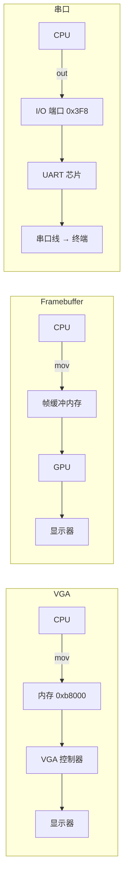
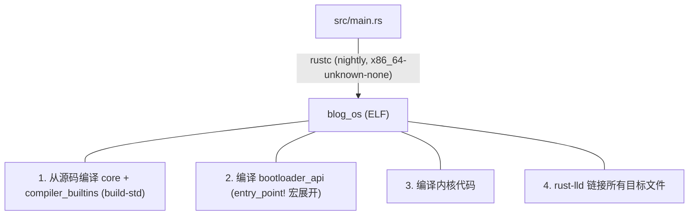
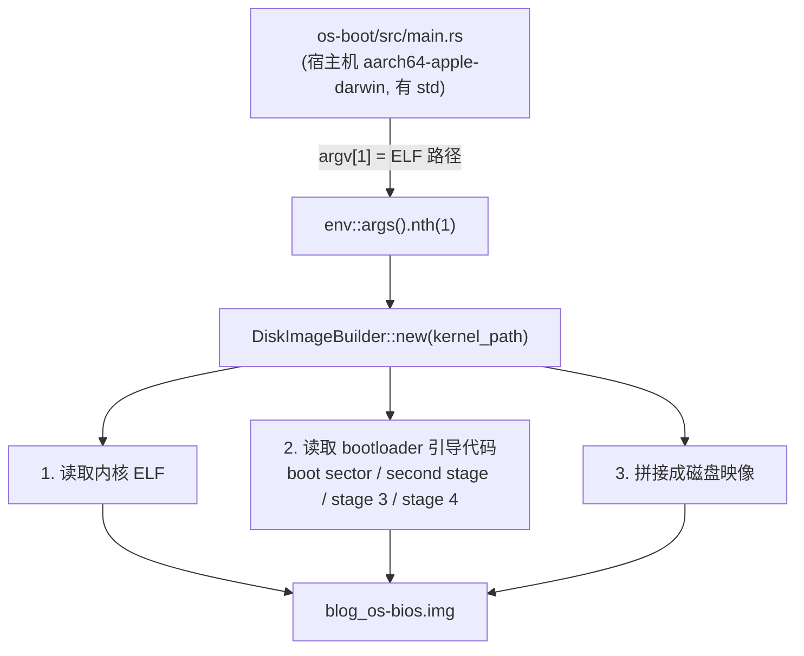
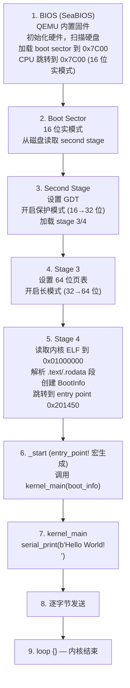
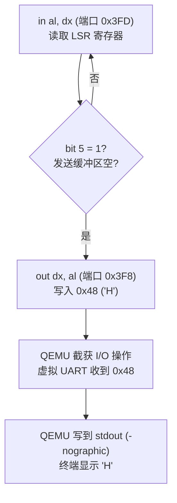

# 用 Rust 写操作系统 - 笔记

## 1. 独立二进制文件

去掉标准库和 C 运行时的 macOS 可执行文件——为裸机开发做准备。

### 关键属性

- `#![no_std]` - 不链接 Rust 标准库（没有 OS 抽象可用）
- `#![no_main]` - 不使用默认入口点 `main`，手动定义 `_start`

### 入口点：`_start`

```rust
#[unsafe(no_mangle)]
pub extern "C" fn _start() -> ! { loop {} }
```

- `#[unsafe(no_mangle)]` - 保留函数名不被修饰。没有它 Rust 会把名字改成类似 `_ZN7blog_os6_start17h...` 的形式，链接器就找不到入口点了
- `extern "C"` - 使用 C 调用约定，链接器才能识别
- `-> !` - 发散函数（永不返回），因为没有东西可以返回到

验证：`nm target/debug/blog_os | grep start` → `T __start`

### Panic 处理

- 默认策略：**栈展开 (unwinding)** - 逐帧回溯调用栈，调用析构函数 (`drop`) 做清理
- 栈展开依赖操作系统支持（`eh_personality` 语言项、libunwind 等）
- 裸机没有 OS，所以在 `Cargo.toml` 中设置 `panic = "abort"` 直接终止

### Cargo.toml：`test = false` / `bench = false`

```toml
[[bin]]
name = "blog_os"
test = false
bench = false
```

- 默认为 `true`，Cargo 会构建依赖 `std` 的**测试框架**
- `std` 自带 `panic_impl` → 和你的 `#[panic_handler]` 冲突（重复 `lang item` 错误）
- `--all-targets` 或 `cargo test` 会触发这个问题
- 后续教程会用 `#![feature(custom_test_frameworks)]` 替代

### macOS 链接器配置

`.cargo/config.toml`：

```toml
[target.'cfg(target_os = "macos")']
rustflags = ["-C", "link-args=-e __start -static -nostartfiles"]
```

- `-e __start` - macOS 给所有 C 符号加 `_` 前缀，所以 `_start` 在符号表中变成 `__start`
- `-static` - 不链接 `libSystem.dylib`（macOS 官方不支持静态二进制，但我们需要避免 OS 依赖）
- `-nostartfiles` - 跳过 `crt0`（C 运行时启动代码）；否则链接器会找 `main` 函数，而我们没有（`#![no_main]`）

Linux 只需要 `-nostartfiles`。

### `-nostartfiles` 的实际作用

macOS **有** C 运行时 (`crt0`)。这个标志不是说它不存在，而是告诉链接器**不要使用它**。

```
不加 -nostartfiles：OS 加载二进制 → crt0 初始化 → 找 main() → 报错（没有 main）
加了 -nostartfiles：OS 加载二进制 → 直接跳转到 _start → 执行你的代码
```

### 当前阶段 vs. 裸机

此时二进制文件仍然是 **macOS 可执行文件**（Mach-O 格式），由 macOS 内核加载运行。目的是练习去掉 `std` 和 `crt0` 依赖。真正的裸机在下一章。

---

## 2. 最小 Rust 内核

从 macOS 可执行文件到真正运行在模拟 x86_64 硬件上的裸机内核。

### 启动流程


Bootloader 完成所有底层工作，我们可以直接用 Rust 写内核逻辑。

### 工具链：`rust-toolchain.toml`

```toml
[toolchain]
channel = "nightly"
components = ["rust-src", "llvm-tools-preview"]
```

- **nightly** - `build-std` 等是不稳定功能，stable 版本不可用
- **rust-src** - 标准库源码。我们的目标平台 (`x86_64-unknown-none`) 没有预编译的 `core`，必须从源码重新编译
- **llvm-tools-preview** - bootloader 创建磁盘映像时需要 `llvm-objcopy` 等工具

### 编译目标：`.cargo/config.toml`

```toml
[build]
target = "x86_64-unknown-none"
rustflags = ["-C", "relocation-model=static"]

[unstable]
build-std = ["core", "compiler_builtins"]
build-std-features = ["compiler-builtins-mem"]
```

第一章的目标是 macOS (`aarch64-apple-darwin`)。现在切换到 **`x86_64-unknown-none`** —— 裸机目标：没有 OS，没有 C 运行时，没有 `std`，只有 `core`。

**`rustflags`**：禁用 PIE（位置无关可执行文件）。内置目标默认生成 PIE，会导致 bootloader 出问题。

**`build-std`**：从源码重新编译 `core`（基本类型、Option、Result 等）和 `compiler_builtins`（编译器内建函数，如整数除法）。

**`compiler-builtins-mem`**：提供 `memcpy`、`memset`、`memcmp` 的实现。正常情况下来自 libc，但裸机没有 libc。

第一章的 macOS 链接器配置（`-e __start -static -nostartfiles`）不再需要。

#### 为什么用 `x86_64-unknown-none` 而不是自定义 JSON 目标

早期做法是创建自定义的 `x86_64-blog_os.json` 来描述裸机目标。现代 nightly 内置的 `x86_64-unknown-none` 更简单，且已包含所有设置：

- **`disable-redzone: true`** - 红区是 System V ABI 的优化：函数可以使用栈指针下方 128 字节而不移动栈指针。中断会往那里压数据，导致损坏。内核中必须禁用
- **`-mmx,-sse,+soft-float`** - 禁用 SIMD，使用软件浮点。每次中断保存/恢复 512 位 XMM 寄存器开销很大，内核几乎不需要浮点运算
- **`panic-strategy: abort`** - panic 时直接终止，不做栈展开
- **`linker: rust-lld`** - Rust 自带的跨平台链接器

使用内置目标可以避免 JSON 格式在不同 nightly 版本间的兼容性问题（字段类型变化、data-layout 格式更新等）。

### 依赖：`Cargo.toml`

```toml
[dependencies]
bootloader_api = "0.11"
```

`bootloader_api` 提供 `entry_point!` 宏和 `BootInfo` 类型（内存映射、framebuffer 信息等）。

### 入口点

```rust
use bootloader_api::entry_point;

entry_point!(kernel_main);

fn kernel_main(_boot_info: &'static mut bootloader_api::BootInfo) -> ! {
    // 内核代码
    loop {}
}
```

`entry_point!` 宏做两件事：

1. 生成真正的 `_start` 函数作为链接器入口（替代第一章手写的 `#[no_mangle] pub extern "C" fn _start`）
2. 对 `kernel_main` 做类型检查——确保签名是 `fn(&'static mut BootInfo) -> !`

比手写 `_start` 更安全，因为宏会在编译期捕获签名错误。

### 三种输出方式

#### 1. VGA 文本缓冲区

直接往内存地址 `0xb8000` 写字符：

```rust
let vga_buffer = 0xb8000 as *mut u8;
unsafe {
    *vga_buffer.offset(0) = b'H';     // 字符
    *vga_buffer.offset(1) = 0xb;      // 颜色：浅青色
}
```

- **`0xb8000`** - VGA 文本模式显存地址。**内存映射 I/O (MMIO)** —— 写入直接改变屏幕显示
- 每个字符 = 2 字节：ASCII 码 + 颜色属性（`背景色(4位) | 前景色(4位)`）
- `0x0b` = 黑底浅青字

```
地址        内容
0xb8000    'H'     ← 字符
0xb8001    0x0b    ← 颜色
0xb8002    'e'
0xb8003    0x0b
...
```

**bootloader 0.11 下不可用** —— 它会切换到图形 framebuffer，VGA 文本模式不再存在。

#### 2. Framebuffer（像素绘制）

bootloader 0.11 通过 `BootInfo` 提供图形 framebuffer（1280x720，BGR 格式）：

```rust
if let Some(fb) = boot_info.framebuffer.as_mut() {
    let info = fb.info();
    let buffer = fb.buffer_mut();

    // 每个像素 3 字节（BGR）
    let offset = (y * info.stride + x) * info.bytes_per_pixel;
    buffer[offset]     = blue;
    buffer[offset + 1] = green;
    buffer[offset + 2] = red;
}
```

显示文字需要位图字体（每个字符是 8x8 像素的网格）。能用但代码较多。

#### 3. 串口（最简单——我们使用的方案）

通过 x86 的 `in`/`out` 指令往 COM1 写字节，QEMU 重定向到终端：

```rust
/// 从 x86 I/O 端口读一个字节
unsafe fn x86_port_read(port: u16) -> u8 {
    let value: u8;
    core::arch::asm!("in al, dx", out("al") value, in("dx") port);
    value
}

/// 往 x86 I/O 端口写一个字节
unsafe fn x86_port_write(port: u16, value: u8) {
    core::arch::asm!("out dx, al", in("al") value, in("dx") port);
}

fn serial_print_byte(byte: u8) {
    unsafe {
        while (x86_port_read(0x3FD) & 0x20) == 0 {}  // 等发送缓冲区空
        x86_port_write(0x3F8, byte);                   // 写字节到 COM1
    }
}
```

- **`0x3F8`** — COM1 数据寄存器
- **`0x3FD`** — 线路状态寄存器 (LSR)；bit 5 = 发送缓冲区空
- **`in` / `out`** — x86 I/O 端口指令，访问的是独立于内存的 I/O 地址空间

```bash
qemu-system-x86_64 -drive format=raw,file=blog_os-bios.img -nographic
# "Hello World!" 直接打印到终端。退出：Ctrl-A 然后 X
```

#### 对比



| | VGA 文本缓冲区 | Framebuffer | 串口 |
|---|---|---|---|
| 访问方式 | 内存地址（指针） | 内存地址（指针） | I/O 端口（`out` 指令） |
| 地址空间 | 内存 | 内存 | I/O（独立，x86 特有） |
| 是否需要等待 | 不需要 | 不需要 | 需要（检查发送缓冲区） |
| Bootloader 0.11 | 不可用 | 通过 `BootInfo` 获取 | 始终可用 |
| 输出目标 | 显示器（文字网格） | 显示器（像素） | 终端（文字流） |

x86 有两套独立的地址空间：内存地址空间（用 `mov` 访问）和 I/O 地址空间（用 `in`/`out` 访问）。大多数现代设备已转向 MMIO；I/O 端口是较老的机制，串口、PS/2 键盘等传统设备仍在使用。

### Panic 处理

```rust
#[panic_handler]
fn panic(_info: &PanicInfo) -> ! {
    loop {}
}
```

和第一章一样。后续章节会改成通过串口/屏幕打印错误信息。

### ELF 与磁盘映像

#### 什么是 ELF

ELF（Executable and Linkable Format，可执行和可链接格式）是 `cargo build` 生成的二进制格式：

```
target/x86_64-unknown-none/debug/blog_os    ← ELF 文件
```

包含：机器码（CPU 指令）、入口点地址（`_start` 在哪）、段信息（代码段/数据段的地址和大小）。可以把它理解为一个带目录的包裹，告诉加载者"把这段代码放到内存的这个位置，然后从这个地址开始执行"。

#### ELF 如何变成可启动映像

```bash
cargo build          # 1. 编译内核 → 生成 ELF
cd ../os-boot        # 2. 独立的宿主机 crate
cargo run -- <ELF>   #    用 DiskImageBuilder 把 ELF + bootloader 打包 → .img
```

`os-boot` 通过 `env::args().nth(1)` 接收 ELF 路径，然后 `DiskImageBuilder` 创建磁盘映像。

#### 为什么 `os-boot` 放在内核目录外面

它需要 `std`（文件 I/O 等），但内核的 `.cargo/config.toml` 强制所有东西都编译到 `x86_64-unknown-none`（没有 `std`）。Cargo 配置会向下继承，子目录无法干净地覆盖。所以磁盘映像构建器必须是内核目录外面的独立 crate。

#### 磁盘映像布局


QEMU 加载这个 `.img` 就像真实硬件从硬盘启动一样。

### 完整执行流程

从 `./run.sh` 到终端显示 "Hello World!" 的全链路：

#### 第一步：`cargo build`（编译内核）



ELF 文件内容：


#### 第二步：`cd ../os-boot && cargo run -- "$KERNEL"`（创建磁盘映像）



磁盘映像内容：


#### 第三步：`qemu-system-x86_64 ... -nographic`（启动虚拟机）

QEMU 参数：
- `-drive format=raw,file=blog_os-bios.img` → "这个文件是一块硬盘"
- `-nographic` → 不开窗口，串口 COM1 重定向到终端 stdout



以 `'H'` (0x48) 为例的串口发送流程：



重复以上流程发送：`'e' 'l' 'l' 'o' ' ' 'W' 'o' 'r' 'l' 'd' '!' '\r' '\n'`

#### 数据流总结


### 编译与运行

```bash
cargo build
cd ../os-boot && cargo run -- ../os/target/x86_64-unknown-none/debug/blog_os
cd .. && qemu-system-x86_64 -drive format=raw,file=target/x86_64-unknown-none/debug/blog_os-bios.img -nographic
```

### 与第一章的关键变化

| | 第 1 章（独立二进制） | 第 2 章（最小内核） |
|---|---|---|
| 运行环境 | macOS 内核 | 裸机（QEMU 模拟） |
| 二进制格式 | Mach-O | ELF（由 bootloader 加载） |
| 入口点 | 手写 `_start` + 链接器参数 | `entry_point!` 宏 |
| 输出 | 无（只是 `loop {}`） | 串口 → 终端 |
| 链接器配置 | `-e __start -static -nostartfiles` | 不需要（目标自带） |

### 踩坑记录（原版教程 vs. 现代工具链）

原版教程基于 `bootloader 0.9` + 旧版 nightly 编写。现代工具链（2024+）需要以下适配：

1. **Bootloader 0.9 与现代 nightly 不兼容** — `+soft-float` 被禁止、`target-pointer-width` 类型从字符串变为整数、`data-layout` 格式更新、bootloader 内部 JSON 目标描述过时。钉死旧 nightly 会连锁引发更多问题（lockfile 格式、属性语法等）。**解决**：使用 `bootloader_api 0.11` + `bootloader 0.11`

2. **没有 VGA 文本模式** — Bootloader 0.11 即使在 BIOS 模式下也会切换到图形 framebuffer。往 `0xb8000` 写数据没有效果。**解决**：使用 `BootInfo` 中的 framebuffer，或串口输出

3. **PIE 可执行文件** — `x86_64-unknown-none` 默认生成 PIE，可能导致 bootloader 加载失败。**解决**：`rustflags = ["-C", "relocation-model=static"]`

4. **磁盘映像构建器变成了库** — Bootloader 0.9 有配套的 `cargo bootimage` CLI 工具。Bootloader 0.11 提供 `DiskImageBuilder` API——需要单独的宿主机 crate

5. **自定义 JSON 目标描述不再必要** — 原版的 `x86_64-blog_os.json` 被内置的 `x86_64-unknown-none` 目标替代，避免了 JSON 格式在不同 nightly 版本间的兼容性问题

---

## 3. 串口文本输出

本章构建串口文本输出抽象。传统做法是在内存地址 `0xb8000` 上构建 VGA 文本缓冲区，但 bootloader 0.11 不提供 VGA 文本模式，因此改用串口输出（COM1，端口 `0x3F8`）。核心概念不变：Writer 结构体、`fmt::Write`、全局实例、`print!` 宏。

### 核心概念

- **Writer 结构体** — `SerialPort` 封装 I/O 端口基地址（VGA 方案用 `Writer` 封装缓冲区指针）
- **`fmt::Write` trait** — 实现 `write_str` 以支持 `write!`/`writeln!` 格式化输出
- **`lazy_static!`** — 首次使用时初始化全局 writer（`init()` 有副作用，无法在编译期调用）
- **`spin::Mutex`** — 自旋锁实现内部可变性；裸机没有 OS = 没有阻塞式互斥锁
- **`print!`/`println!` 宏** — `#[macro_export]` 让宏在整个 crate 可用，通过 `$crate::serial::_print` 调用

### 新增依赖

```toml
[dependencies]
lazy_static = { version = "1.0", features = ["spin_no_std"] }
spin = "0.9"
```

- **`lazy_static`** — 延迟初始化全局变量。`spin_no_std` feature 让它内部用 `spin::Once` 代替 `std::sync::Once`，不依赖标准库
- **`spin`** — 自旋锁。裸机没有 OS 提供的阻塞式互斥锁，自旋锁用忙等循环替代

### VGA 方案 vs. 串口方案

| VGA 文本缓冲区 | 串口 |
|---|---|
| `volatile::Volatile` 做 MMIO 写入 | `in`/`out` 指令做 I/O 端口操作 |
| `Writer` 需要跟踪行列位置、颜色码 | `SerialPort` — 只管写字节，终端负责显示 |
| 缓冲区在 `0xb8000`（内存映射） | COM1 在 `0x3F8`（I/O 端口空间） |
| 依赖 `volatile` crate | 不需要额外依赖 |
| 必须处理换行（滚动缓冲区） | 终端自己处理滚动 |

### 逐行讲解 `serial.rs`

#### 引入依赖

```rust
use core::fmt;
```

引入 `core::fmt` 模块。`core` 是 Rust 标准库的"裸机版"，不依赖操作系统。`fmt` 里有格式化输出的东西，比如 `fmt::Write` trait、`fmt::Arguments` 类型。后面要用它让 `SerialPort` 支持 `write!()` 格式化。

```rust
use lazy_static::lazy_static;
```

从 `lazy_static` crate 引入 `lazy_static!` 宏。这个宏让你创建"第一次用到时才初始化"的全局变量。为什么需要？因为 Rust 的 `static` 变量要求值在**编译期**就能确定，但串口初始化要执行 I/O 指令（运行时操作），编译期做不了。

```rust
use spin::Mutex;
```

从 `spin` crate 引入自旋锁。普通的 `std::sync::Mutex` 依赖操作系统（线程挂起、唤醒），我们在裸机上没有 OS，所以用自旋锁——获取不到锁就一直循环问"好了没？好了没？"直到拿到。

#### I/O 端口操作：`inb` / `outb`

```rust
unsafe fn inb(port: u16) -> u8 {
    let value: u8;
    core::arch::asm!("in al, dx", out("al") value, in("dx") port, options(nomem, nostack));
    value
}
```

`unsafe` 因为要执行汇编指令，Rust 编译器无法保证安全。`port: u16` 是端口号（比如 `0x3FD`），返回一个字节。函数名 `inb` 是 Linux 内核的传统命名：**in** = 读入，**b** = byte。

内联汇编翻译成人话：

1. 把 Rust 变量 `port` 的值放进 CPU 的 `dx` 寄存器 → `in("dx") port`
2. 执行 x86 指令 `in al, dx` → "从 `dx` 指定的端口读 1 字节，结果放到 `al` 寄存器"
3. 把 `al` 寄存器的值取出来，存到 Rust 变量 `value` → `out("al") value`

`options(nomem, nostack)` 告诉编译器：这条汇编不会读写内存（`nomem`），也不会动栈（`nostack`），方便编译器做优化。

```rust
unsafe fn outb(port: u16, value: u8) {
    core::arch::asm!("out dx, al", in("al") value, in("dx") port, options(nomem, nostack));
}
```

和 `inb` 反过来：把 `value` 放进 `al`，把 `port` 放进 `dx`，执行 `out dx, al` → "把 `al` 的值写到 `dx` 指定的端口"。比如 `outb(0x3F8, b'H')` = 往 COM1 数据端口写字母 'H'。

#### `SerialPort` 结构体

```rust
pub struct SerialPort {
    base: u16,
}
```

只存一个东西：**基地址**。COM1 的基地址是 `0x3F8`。UART 芯片的各个寄存器都是从这个基地址偏移的（`base+0` 到 `base+5`），所以只要存一个 `base`，加偏移就能访问所有寄存器。

#### 构造函数

```rust
pub const fn new(base: u16) -> Self {
    SerialPort { base }
}
```

`const fn` 意味着这个函数可以在编译期执行。它只是把 `base` 存进结构体，没有任何副作用，所以能做到。这让 `lazy_static!` 内部可以调用它。

#### 串口初始化 `init()`

```rust
pub fn init(&self) {
    unsafe {
        outb(self.base + 1, 0x00); // Disable interrupts
        outb(self.base + 3, 0x80); // Enable DLAB (set baud rate divisor)
        outb(self.base + 0, 0x01); // Set divisor to 1 (115200 baud)
        outb(self.base + 1, 0x00); //   (hi byte)
        outb(self.base + 3, 0x03); // 8 bits, no parity, one stop bit
        outb(self.base + 2, 0xC7); // Enable FIFO, clear them, 14-byte threshold
        outb(self.base + 4, 0x0B); // IRQs enabled, RTS/DSR set
    }
}
```

7 条 `outb` 逐条解释：

**第 1 条** — 往中断启用寄存器（`base+1`）写 0 → 关闭所有中断。先关掉，别在配置过程中被打断。

**第 2 条** — 往线路控制寄存器（`base+3`）写 `0x80`（二进制 `10000000`，bit 7 = 1）。这会打开 **DLAB 开关**（Divisor Latch Access Bit）。打开后，`base+0` 和 `base+1` 这两个端口的含义**临时变了**——从"数据/中断"变成"波特率除数低字节/高字节"。

**第 3-4 条** — 设置波特率除数 = `0x0001`（低字节 1，高字节 0）。UART 基础时钟 1,843,200 Hz，波特率 = 1,843,200 / (16 × 除数) = **115200**。波特率就是每秒传输多少个 bit。115200 bps 下，串口用 8N1 格式（8 数据位 + 1 起始位 + 1 停止位 = 每字节 10 bit），实际速度 = 115200 / 10 ≈ **11.25 KB/s**。串口是异步通信，收发双方没有共享时钟线，必须约定同一个波特率才能正确采样每个 bit。

**第 5 条** — 再次写 `base+3`，这次写 `0x03`（二进制 `00000011`）。bit 7 = 0 → **关闭 DLAB**（端口功能恢复正常）。bit 0-1 = `11` → 8 数据位。其余 bit = 0 → 无校验、1 停止位。合起来就是 **8N1** 格式。

**第 6 条** — `0xC7` = `11000111`，写入 FIFO 控制寄存器（`base+2`）。bit 0 = 启用 FIFO，bit 1-2 = 清空收发缓冲区，bit 6-7 = 触发阈值 14 字节。详见下方 FIFO 章节。

**第 7 条** — `0x0B` = `00001011`，写入 Modem 控制寄存器（`base+4`）。DTR（数据终端就绪）= 1，RTS（请求发送）= 1，OUT2 = 1（PC 上控制中断是否能传到 CPU）。标准初始化，告诉对方"我准备好了"。

##### UART 16550 寄存器布局

基地址 `0x3F8`（COM1）为例：

```
端口        寄存器                   用途
0x3F8      数据寄存器 / 除数低字节    读写数据 / DLAB=1 时设波特率
0x3F9      中断启用 / 除数高字节      启用/禁用中断 / DLAB=1 时设波特率
0x3FA      中断识别 / FIFO 控制      读中断状态 / 写 FIFO 配置
0x3FB      线路控制寄存器 (LCR)       数据格式（位数、校验、停止位）+ DLAB 位
0x3FC      Modem 控制寄存器          RTS、DTR 等信号线
0x3FD      线路状态寄存器 (LSR)       bit 5 = 发送缓冲区空
```

**DLAB（Divisor Latch Access Bit）**：LCR 的 bit 7。设为 1 时，端口 `base+0` 和 `base+1` 变成波特率除数寄存器；设为 0 时恢复为数据/中断寄存器。所以初始化顺序是：先设 DLAB=1 配置波特率，再设 DLAB=0 恢复正常功能。

##### FIFO（先进先出缓冲队列）

没有 FIFO 时（老旧 8250 UART），芯片内部只有 **1 字节**缓冲。每收到 1 字节就触发一次中断，CPU 必须立刻来取走，否则下一个字节到了就**覆盖**掉了：

```
UART 收到 'H' → 中断 → CPU 来取
UART 收到 'e' → 中断 → CPU 来取
UART 收到 'l' → 中断 → CPU 来取
...
5 个字节 = 5 次中断，每次中断 CPU 都要保存寄存器、跳转到处理函数、恢复，开销很大。
如果 CPU 正在忙别的事来不及取，字节就丢了。
```

有 FIFO 时（16550 UART），芯片内部有 **16 字节**队列，字节先攒着，攒到阈值再通知 CPU：

```
UART 收到 'H' → 放进 FIFO
UART 收到 'e' → 放进 FIFO
...
FIFO 攒够 14 字节 → 触发一次中断 → CPU 一口气读走 14 字节
```

14 个字节只要 **1 次中断**。

阈值为什么设 14 而不是 16？留余量。FIFO 总共 16 字节，如果设满 16 才触发中断，中断从触发到 CPU 实际处理有延迟，期间如果又来了新字节就**溢出丢数据**。设成 14，还剩 2 字节空间当缓冲：

```
收到第 14 字节 → 触发中断
收到第 15 字节 → CPU 还没来，没关系，FIFO 还有位置
收到第 16 字节 → CPU 还没来，最后一个位置
CPU 来了 → 一口气读走 16 字节，没丢
```

16550 只提供 4 档可选：

| 阈值 | 中断频率 | 安全余量 | 适用场景 |
|---|---|---|---|
| 1 | 最高（几乎每字节一次） | 15 字节 | 低速、对延迟敏感 |
| 4 | 高 | 12 字节 | — |
| 8 | 中 | 8 字节 | — |
| **14** | **最低** | **2 字节** | **高速、减少中断开销** |

当前代码用的是**逐字节轮询发送**（每写 1 字节就死等到发完再写下一个），没有用中断，也没有利用 FIFO 的批量能力。FIFO 的"攒够阈值再通知"是针对**接收方 + 中断驱动**的场景。初始化时启用 FIFO 只是做了两件事：清空收发缓冲区里可能残留的垃圾数据，以及为将来改用中断驱动做准备。

#### 检查发送缓冲区

```rust
fn is_transmit_empty(&self) -> bool {
    unsafe { inb(self.base + 5) & 0x20 != 0 }
}
```

读线路状态寄存器（LSR，`base+5`），用 `& 0x20`（二进制 `00100000`）检查 **bit 5**。bit 5 = 1 表示发送缓冲区空了，可以写下一个字节。bit 5 = 0 表示还在忙，得等。

#### 发送一个字节

```rust
pub fn write_byte(&self, byte: u8) {
    while !self.is_transmit_empty() {}
    unsafe { outb(self.base, byte) }
}
```

第一行：死循环等，直到发送缓冲区空了。这叫**轮询（polling）**——CPU 傻站着不断问"好了没？"。低效但简单。

第二行：往数据寄存器（`base+0`）写这个字节。UART 芯片收到后会通过串口线一个 bit 一个 bit 发出去。

#### 实现 `fmt::Write` trait

```rust
impl fmt::Write for SerialPort {
    fn write_str(&mut self, s: &str) -> fmt::Result {
        for byte in s.bytes() {
            if byte == b'\n' {
                self.write_byte(b'\r');
            }
            self.write_byte(byte);
        }
        Ok(())
    }
}
```

`fmt::Write` trait 只要求实现一个方法：`write_str`。实现之后，`SerialPort` 自动获得 `write_fmt` 方法，就能用 `write!(port, "x = {}", 42)` 这样的格式化输出了。

逐行：
- `for byte in s.bytes()` — 把字符串拆成字节，逐个处理
- `if byte == b'\n'` — 遇到换行符 `\n` 时，先发一个回车 `\r`。串口终端的规矩是用 `\r\n` 换行：`\r` 把光标移到行首，`\n` 移到下一行。只发 `\n` 的话光标会换行但不回到行首，文字会"阶梯状"错开
- `self.write_byte(byte)` — 发送当前字节
- `Ok(())` — 返回成功（我们的实现不会失败）

#### 全局串口实例：`lazy_static!` + `spin::Mutex`

```rust
lazy_static! {
    pub static ref SERIAL1: Mutex<SerialPort> = {
        let serial = SerialPort::new(0x3F8);
        serial.init();
        Mutex::new(serial)
    };
}
```

创建全局变量 `SERIAL1`，类型 `Mutex<SerialPort>`。`lazy_static!` 保证这段代码只在**第一次访问 `SERIAL1` 时**执行一次。

- `SerialPort::new(0x3F8)` — 创建 SerialPort，基地址 COM1
- `serial.init()` — 执行前面那 7 条 `outb`，配置 UART 芯片。这就是为什么不能用普通 `static`——`init()` 要执行 I/O 指令，编译期做不了
- `Mutex::new(serial)` — 包进自旋锁。`SERIAL1` 是全局的，理论上可能有多处代码同时调用 `println!`。锁保证同一时刻只有一个地方在操作串口，避免输出混在一起（比如两个 "Hello" 交错成 "HHeelllloo"）

关键点：
- **`lazy_static!`** — 延迟到首次访问时初始化（Rust 的 `static` 要求编译期常量表达式，`init()` 有 I/O 副作用做不到）
- **`spin_no_std` feature** — 内部用 `spin::Once` 代替 `std::sync::Once`，不依赖标准库
- **`spin::Mutex`** — 通过 `lock()` 提供 `&mut` 访问。用忙等循环替代阻塞（裸机没有调度器，无法挂起线程）。单核内核安全；多核需要注意

#### `_print` 辅助函数

```rust
#[doc(hidden)]
pub fn _print(args: fmt::Arguments) {
    use core::fmt::Write;
    SERIAL1.lock().write_fmt(args).expect("serial print failed");
}
```

- `#[doc(hidden)]` — 在文档中隐藏，因为它是内部实现细节，用户应该用 `print!` 宏而不是直接调用 `_print`。`pub` 是因为宏展开后需要跨模块调用它。下划线前缀也暗示"这不是给你直接用的"
- `fmt::Arguments` — `format_args!` 宏生成的类型，包含格式化字符串和参数，但**不分配堆内存**
- `use core::fmt::Write` — 在函数内部引入 `Write` trait，这样 `.write_fmt()` 才能用。放在函数内部是为了不污染模块的命名空间
- `SERIAL1.lock()` — 获取自旋锁，返回 `MutexGuard<SerialPort>`，它实现了 `DerefMut`，可以当 `&mut SerialPort` 用
- `.write_fmt(args)` — `fmt::Write` trait 自动提供的方法，内部会调用我们写的 `write_str`，把格式化后的文本逐段发送
- `.expect(...)` — `write_fmt` 返回 `Result`，如果失败就 panic（实际上我们的 `write_str` 永远返回 `Ok`，不会失败）
- 函数结束时 `MutexGuard` 被 drop，自动释放锁

#### `print!` / `println!` 宏

```rust
#[macro_export]
macro_rules! print {
    ($($arg:tt)*) => ($crate::serial::_print(format_args!($($arg)*)));
}

#[macro_export]
macro_rules! println {
    () => ($crate::print!("\n"));
    ($($arg:tt)*) => ($crate::print!("{}\n", format_args!($($arg)*)));
}
```

- **`#[macro_export]`** — 把宏提升到 crate 根目录。效果是任何地方都能直接写 `print!()`，不需要 `use`
- **`$($arg:tt)*`** — 匹配任意数量的 token（token tree）。"不管你传什么进来，原样转发"
- **`format_args!`** — 编译器内建宏，把 `"x = {}", 42` 变成一个 `fmt::Arguments` 对象。关键：**不分配堆内存**，只是持有对参数的引用（裸机没有堆）
- **`$crate`** — 解析为定义该宏的 crate 的路径，确保跨模块使用时路径正确
- **`println!`** 有两个分支：不带参数时只打印换行，带参数时在内容后加 `\n` 然后调用 `print!`

`print!("x = {}", 42)` 展开后就是：

```rust
crate::serial::_print(format_args!("x = {}", 42));
```

#### 完整调用链

```
println!("x = {}", 42)
  ↓ 宏展开
print!("{}\n", format_args!("x = {}", 42))
  ↓ 宏展开
_print(format_args!("{}\n", format_args!("x = {}", 42)))
  ↓
SERIAL1.lock().write_fmt(args)
  ↓ fmt::Write trait
write_str("x = 42\n")
  ↓ 逐字节
write_byte(b'x'), write_byte(b' '), write_byte(b'='), ...
  ↓ 每个字节
while !is_transmit_empty() {}   ← 轮询等待
outb(0x3F8, byte)               ← 写入串口
  ↓
UART 芯片发送 → QEMU 截获 → 终端显示
```

### Panic 处理现在能打印了

```rust
#[panic_handler]
fn panic(info: &PanicInfo) -> ! {
    println!("PANIC: {}", info);
    loop {}
}
```

`PanicInfo` 实现了 `Display`，直接打印就能得到文件名、行号和错误消息。

### 不需要 `volatile` crate

VGA 方案用 `volatile::Volatile` 包装缓冲区的每个字符单元，防止编译器把"看起来无用的"内存写入优化掉（编译器不知道 `0xb8000` 是 MMIO，可能认为写了又没读，直接删掉）。

串口不需要：`in`/`out` 指令在 `asm!` 块中，编译器不会优化掉内联汇编。I/O 端口操作天然具有副作用语义。
